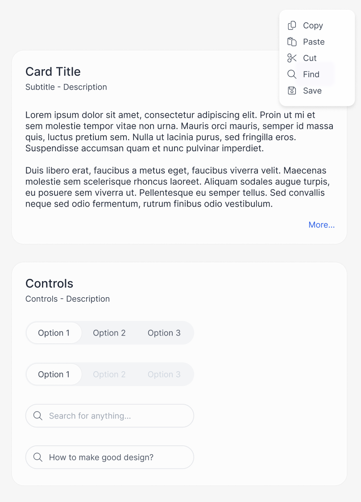

# Visual Style

## Overview

This specification defines a unified visual style system for consistent theming across UI components.

## Color Tokens

important! We should be using the background shorthand CSS property that sets all background style properties at once, such as color, gradient (internally a generated image), image, origin and size, or repeat method.
[https://developer.mozilla.org/en-US/docs/Web/CSS/background](https://developer.mozilla.org/en-US/docs/Web/CSS/background)
[https://developer.mozilla.org/en-US/docs/Web/CSS/CSS_images/Using_CSS_gradients](https://developer.mozilla.org/en-US/docs/Web/CSS/CSS_images/Using_CSS_gradients)

### System Colors

- **`red`**:
  - _Default (light)_: `rgb(255, 56, 60)`
  - _Usage_: Error states, destructive actions, critical alerts, validation failures…
  - _Example_: "Remove item" button, form error text
- **`orange`**:
  - _Default (light)_: `rgb(255, 141, 40)`
  - _Usage_: Warning states, caution indicators, pending states…
  - _Example_: "Review required" badges, warnings…
- **`green`**: growth indicators
  - _Default (light)_: `rgb(52, 199, 89)`
  - _Usage_: Success states, positive actions, completed tasks…
  - _Example_: "Saved successfully", completed checkboxes
- **`yellow`**:
  - _Default (light)_: `rgb(255, 204, 0)`
- **`mint`**:
  - _Default (light)_: `rgb(0, 200, 179)`
- **`teal`**:
  - _Default (light)_: `rgb(0, 195, 208)`
- **`cyan`**:
  - _Default (light)_: `rgb(0, 192, 232)`
- **`blue`**:
  - _Default (light)_: `rgb(0, 136, 255)`
- **`indigo`**:
  - _Default (light)_: `rgb(97, 85, 245)`
- **`purple`**:
  - _Default (light)_: `rgb(203, 48, 224)`
- **`pink`**:
  - _Default (light)_: `rgb(255, 45, 85)`
- **`brown`**:
  - _Default (light)_: `rgb(172, 127, 94)`

### Color Palette

- see with Rachel
- We need to see how we define one
- how do we define it
- how do we map colors from the palette to the different semantic colors we want:  canvasSurfaceColor, raisedSurfaceColor, textColor, etc...
- queation about hue nad color components in general

### Surface Colors

- **`baseSurfaceColor`**:

  - _Default (light)_: `rgba(246 246 246, 1)`
  - _Usage_: The base background for primary interface areas.
  - _Example_: Main content areas, page backgrounds.
- **`raisedSurfaceColor`**:

  - _Default (light)_: `rgba(252 252 252, 1)`
  - _Usage_: Elements with a slight elevation to distinguish them from the canvas.
  - _Example_: Cards, ~~widgets~~, highlighted content tiles.
- **`elevatedSurfaceColor`**:

  - _Default (light)_: `rgba(254 254 254, 0.96)`
  - _Usage_: Floating elements that sit above all other content.
  - _Example_: Modals, dropdown menus, dialogs.

  ### ControlBackground Colors

  - questions: dp we keep just the prrefic control as the marker vs "content" or "physical" surface stuff are on, or do we prefix those as well, like environmentBaseSurfaceColor? environmentRaisedSurfaceColor, environmentElevatedSurfaceColor
- **`controlBackgroundColor`**:

  - _Default (light)_: `rgba(252 252 252, 1)`
  - _Usage_: Elements with a slight elevation to distinguish them from the canvas.
  - _Example_: Cards, widgets, highlighted content tiles.
- **`controlSecondaryBackgroundolor`**:

  - _Default (light)_: `rgba(243 244 246, 1)`
  - _Usage_:  color for a second interactive element or a control, like the second knob in a multi slider
  - _Example_: Sliders
- **`controlTertiaryBackgroundColor`**:

  - _Default (light)_: `rgba(243 244 246, 1)`
  - _Usage_:  color for a third interactive element or a control, like the third knob in a multi slider
  - _Example_: Sliders
- **`controlQuaternaryBackgroundColor`**:

  - _Default (light)_: `rgba(243 244 246, 1)`
  - _Usage_:  color for a fourth interactive element or a control, like the fourth knob in a multi slider
  - _Example_: Sliders

  #### Control Colors
- **`controlColor`**:

  - _Default (light)_: `rgba(243 244 246, 1)`
  - _Usage_: Background color for interactive elements
  - _Example_: Buttons, form fields
- **`controlSecondaryColor`**:

  - _Default (light)_: `rgba(243 244 246, 1)`
  - _Usage_:  color for a second interactive element or a control, like the second knob in a multi slider
  - _Example_: Sliders
- **`controlTertiaryColor`**:

  - _Default (light)_: `rgba(243 244 246, 1)`
  - _Usage_:  color for a third interactive element or a control, like the third knob in a multi slider
  - _Example_: Sliders
- **`controlQuaternaryColor`**:

  - _Default (light)_: `rgba(243 244 246, 1)`
  - _Usage_:  color for a fourth interactive element or a control, like the fourth knob in a multi slider
  - _Example_: Sliders

There's a limit to how much interactive parts a control should have where it would become a usability liabilty... So if one wants that, we don't want to encourage it. It can be a one-off

- **`controlSelectionColor`**:

  - _Default (light)_: `rgba(252 252 252, 1)`
  - _Usage_: Use when you want to show that a selection is or has bee made. So for a slider, if it's not been used by the user, the knowb/thumb/handle would have the controlColor. But while being used, it could take the controlSelectinColor, and it could even keep that controlSelectinColor once the interation is over to highlight the fact that a new value was selected
  - _Example_: Selected dropdown options, active tabs
- **`controlSelectionBackgroundColor`**:

  - _Default (light)_: `rgba(252 252 252, 1)`
  - _Usage_: Use when a selection is or has bee made. So for a slider, if it's not been used by the user, the track left to the thumb/handle/knob, which represent the value selected, should be of controlSelectionBackgroundColor, which defaults to controlBackgroundColor. The part of the track right to the thumb/handle/knob should be of controlBackgroundColor. This should be used as well for select list items.
  - _Example_: value selected with a slider, selected items in a list
- **`controlHoverColor`**:

  - _Default (light)_: `rgba(239, 240, 243, 1)`
  - _Usage_: Background color when hovering over interactive elements
  - _Example_: Button hover state, card hover effect, menu item hover
- **`controlActiveColor`**:

  - _Default (light)_: `rgba(230, 233, 237, 1)`
  - _Usage_: color of the control when the use actively interacts with it. Defaults to controlSelectionColor
  - _Example_: Button pressed state, active dropdown item
- **`controlFocusColor`**: (highlight)

  - _Default (light)_: `rgba(248, 249, 251, 1)`
  - _Usage_: Background color for focused interactive elements
  - _Example_: Focused input fields, keyboard-navigated buttons

### Text Colors

#### Primary Text Hierarchy

- **`textColor`**:
  - _Default (light)_: `rgba(32 21 57, 1)`
  - _Usage_: Primary content text with maximum readability
  - _Example_: Body text, main headings, critical information
- **`secondaryTextColor`**:
  - _Default (light)_: `rgba(54 65 82, 1)`
  - _Usage_: Supporting text with reduced emphasis
  - _Example_: Subheadings, descriptive text, metadata
- **`tertiaryTextColor`**:
  - _Default (light)_: `rgba(75 85 101, 1)`
  - _Usage_: Subtle text for minimal emphasis
  - _Example_: Image captions, footnotes print, helper text, captions
- **`quaternaryTextColor`**:
  - _Default (light)_: `rgba(105 117 134, 1)`
  - _Usage_: Minimal emphasis text (very low information)
  - _Example_: Decorative text, Watermarks, subtle badges, divider labels

#### Specialized Text Colors

- **`linkTextColor`**:
  - _Default (light)_: `rgba(21 94 239, 1)`
  - _Usage_: Interactive text elements and hyperlinks
  - _Example_: Navigation links, in-text links, clickable elements

#### Control-Specific Text Colors

- **`controlTextColor`**:
  - _Default (light)_: `rgba(75 85 101, 1)`
  - _Usage_: Text within interactive controls
  - _Example_: Button labels, dropdown options, checkbox labels
- **`controlAccentTextColor`**:
  - _Default (light)_: `rgba(54 65 82, 1)`
  - Usage: Text for selected or active controls to provide strong visual feedback.
  - Example: The text of a selected tab, a highlighted dropdown option, a checked radio button`s label.
- **`controlPlaceholderTextColor`**:
  - _Default (light)_: `rgba(154 164 178, 1)`
  - _Usage_: Placeholder text in form controls
  - _Example_: Input hints, search field placeholders
- **`controlDisabledTextColor`**:
  - _Default (light)_: `rgba(205 213 223, 1)`
  - _Usage_: Text for unavailable interface elements
  - _Example_: Disabled buttons, inactive menu items, locked features

### Border Colors

- **`controlBorderColor`**:
  - _Default (light)_: `rgba(229 231 235, 1)`
  - Usage: Default border for interactive controls, defining their shape and clickable area.
  - Example: Text input fields, select dropdowns, outlined buttons, unchecked checkboxes.

### Elevation

- **`softShadow`**:
  - _Value_: `0 1px 3px rgba(0, 0, 0, 0.1), 0 1px 2px rgba(0, 0, 0, 0.06)`
  - _Usage_: Subtle elevation for small components
  - _Example_: Buttons, small cards, badges
- **`mediumShadow`**:
  - _Value_: `0 4px 6px rgba(0, 0, 0, 0.07), 0 2px 4px rgba(0, 0, 0, 0.06)`
  - _Usage_: Standard elevation for medium components
  - _Example_: Cards, panels, navigation bars
- **`largeShadow`**:
  - _Value_: `0 10px 15px rgba(0, 0, 0, 0.1), 0 4px 6px rgba(0, 0, 0, 0.05)`
  - _Usage_: Prominent elevation for larger components
  - _Example_: Modals, large cards, floating panels

### Illustration

### thinking…

**ModMaterial**:

- surface:
  - Transparency: `full`, `translucent`, `none`
  - Elevation: `soft`, `medium`, `large`
  - Variant: `outlined`, `filled`, `subtle` / `minimal` (buttons, select, textfield, tags…)
  - Corners: `sharp`, `rounded`, `full`
  - Color: `primary`, `secondary`, `success`, `error`, `warning`, `info`, `neutral`
- border:
  - width: `none`, `thin`, `medium`, `thick`
  - style: `solid`, `dashed`, `dotted`
- dimensions:
  - width: `auto` | `fit` | `full` | `xs` | `sm` | `md` | `lg` | `xl` | `xxl`
  - height: `auto` | `fit` | `full` | `xs` | `sm` | `md` | `lg` | `xl` | `xxl`
- size: `xs`, `sm`, `md`, `lg`, `xl` (short cut to dimensions?)
- spacing: `compact`, `comfortable`, `spacious`
- stateManagement? `default`, `hover`, `active`, `disabled`, `focus`, `selected`

## Typography

[https://www.fourzerothree.in/p/typography-system](https://https://www.fourzerothree.in/p/typography-system)

- Defining a Typographic Scale:
  - Typography “Roles”:
    - Display
    - Heading
    - Label
    - Body
- reference from that article: [https://base.uber.com/6d2425e9f/p/976582-typography](https://https://base.uber.com/6d2425e9f/p/976582-typography)
- [https://www.fourzerothree.in/p/typography-variables](https://https://www.fourzerothree.in/p/typography-variables)
